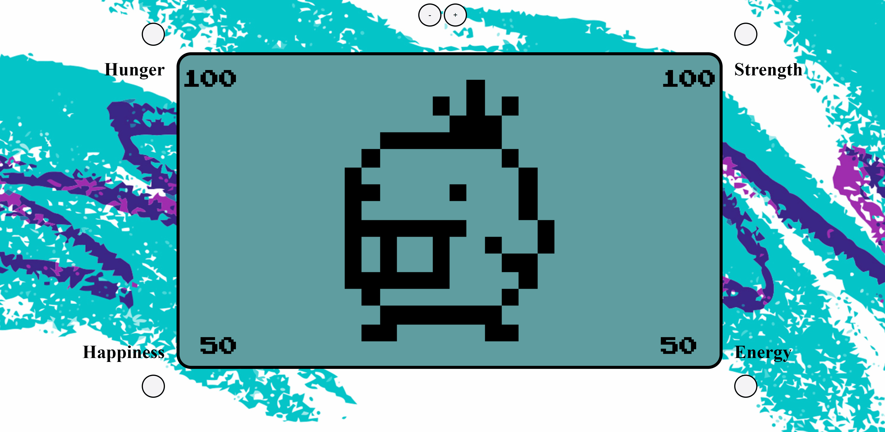

# Tamagotchi
Tamagotchi marks our class's first project requiring SASS and JS modules. On page load, a user sees a screen with a Tamagotchi character in the center and some attributes with cuttons and scores, plus a couple iterator buttons. Initially the iterator buttons do nothing, but upon clicking a button attached to an attribute, the add or subtract a random value within a certain range from that attribute score, capped at 0 and 100. I'm proud of the design on this one, which takes into account the limitations imposed by physical buttons on Tamagotchi devices and attempts to do as much as possible with as few buttons as possible.

## Assignment Instructions
https://github.com/nss-nightclass-projects/exercise-vault/blob/master/MODULES_tamagotchi.md

## Preview

## View Project
https://ap-tamagotchi.web.app/

## Technologies Used
    

## Additional Notes
This project is complete and will receive no further updates so as to maintain a clear progression of skills and learning
This section has moved here: https://facebook.github.io/create-react-app/docs/code-splitting
